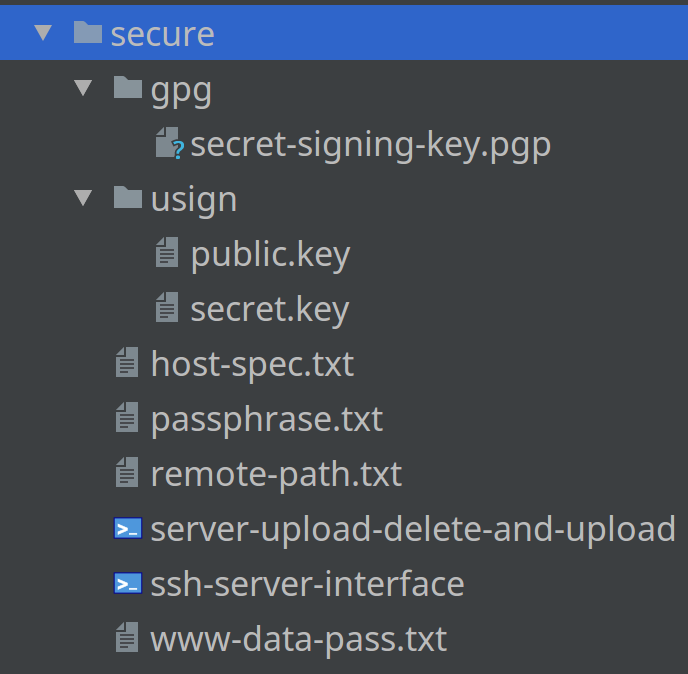

[//]: #@corifeus-header

  [](https://travis-ci.org/patrikx3/lede-insomnia)  [](https://scrutinizer-ci.com/g/patrikx3/lede-insomnia/?branch=master)  [](https://scrutinizer-ci.com/g/patrikx3/lede-insomnia/?branch=master) 

# Latest Stable LEDE Version with many plus packages

---

 
                        
[//]: #@corifeus-header:end

LEDE Latest Stable build with latest NodeJs, LUCI dark matter, eduperez/mwlwifi_LEDE's WIFI driver, Redis 4, MariaDB

... and many pre-built packages and firmwares, image builder, Linksys WR1900ACS/WRT3200ACM and D-Link DIR860l B1 is already built, but based on the READMEs, you can built a new one easy.  

### The packages that are pre-built in all ```insomnia``` firmwares
* bash
* luci-mod-admin-full
* luci-app-firewall
* luci-app-openvpn
* luci-app-samba
* luci-app-upnp
* luci-theme-bootstrap
* firewall
* dropbear
* ca-certificates
* nano
* miniupnpd
* watch
* whereis 
* everything to you need to create ext-root via USB
* curl
* git
* wget
* openvpn
* samba
* bootstrap
* openssh-sftp-server
* openvpn-easy-rsa
* rsync
* wpad & hostapd-utils so you can use ***WPS***
* and all packages have luci settings as well

Besides, the most important packages are there, like:  

* mysql
* postresql
* nginx
* apache
* sqllite
* php7
* python 2
* perl
* redis 4
* msmtp
* mariadb 5.5

I cant's list all of it, there is enough for now. See what is in [create from scratch](docs/create-from-scratch.md).

[Redis 4 is here!](https://cdn.corifeus.com/lede/17.01.3/packages/arm_cortex-a9_vfpv3/redis/) but in D-Link DIR860l B1 as well.

[MariaDB 5.5 is here!](https://cdn.corifeus.com/lede/17.01.3/packages/arm_cortex-a9_vfpv3/mariadb/) but in D-Link DIR860l B1 as well.

## Requirements

**Docker CE**

For your workstation you don't really NodeJs, but my Travis, Scrutinizer and my auto generated web sites are required...   
   
This is a LEDE Docker builder and a living Docker repo as well, ready to build, a lot already built.
(A big image / full firmware, the most important packages are built. Ready to use.)  

# Routers pre-built

If you want to install right away with LUCI:
https://cdn.corifeus.com/lede/17.01.3/

* Linksys WRT1900ACS / Linksys WRT3200ACM / Linksys WRT1900ACS-eduperez-mwlwifi / Linksys WRT3200ACM-eduperez-mwlwifi
  * https://cdn.corifeus.com/lede/17.01.3/targets/mvebu/generic/
    * If you get the error ```The uploaded image file does not contain a supported format. Make sure that you choose the generic image format for your platform.```, you have to do it via SSH with ```sysupgrade -F FIRMWARE```, then it works.

* D-Link DIR-860l B1
  * https://cdn.corifeus.com/lede/17.01.3/targets/ramips/mt7621/
    * If it is not working, with D-Link DIR-860l B1, you have to reset the router and re-load the firmware via emergency upload, like this
      1. Plug the Ethernet cable that connects your computer, that was plugged into one of the LAN ports, 
      1. Setup your PC with static IP - ex: 192.168.0.2 (different from 192.168.0.1), the gateway is 192.168.0.1, netmask 255.255.255.0
      1. Make sure the PC has the new firmware 
      1. Turn off the router
      1. Hold the reset button (in the bottom, there is a small whole for like a needle, it says RESET).
      1. Turn on the router and wait for like 3-5 seconds, the orange will flash, like turning off.
      1. Open a web browser to 192.168.0.1 and then you should see EMERGENCY FLASHING page then click browse/upload locate the file and click UPLOAD FIRMWARE NOW.
      1. For me, for first upload it doesn't do anything, I just click UPLOAD again and then it start uploading.
      1. You should see a SUCCSESS page, 
      1. You will have to wait until like 150 seconds.
      1. When it is green, you can turn off the static settings for the ethernet and enable DHCP.
      1. The you can open with 192.168.1.1, no password at all, you got LUCI and SSH as well.
      1. It works for sure, it's not like Linksys WRT, that you need an USB-TTL cable…

For Linksys the firmwares that start with ```insomnia-eduperez-mwlwifi``` worth trying, because your WIFI is will be flying.


# Signatures

## If you do not want to have the hassle, there are multiple solutions below.

This for building, by now, everything is verified from ```cdn.corfifeus.com```. But, if you build and don't want to care about signature, because it is your own build, so, you don't need it. There are the solutions below.

### Manual 1

The easiest solution I know is via LUCI :  
[http://192.168.1.1/cgi-bin/luci/admin/system/packages/ipkg](http://192.168.1.1/cgi-bin/luci/admin/system/packages/ipkg)    
  
In the **Configuration** tab, comment like this:  
```#option check_signature 1```

### Manual 2
  
You can also set it up via SSH as:
```text
root@digi:~# cat /etc/opkg.conf
dest root /
dest ram /tmp
lists_dir ext /var/opkg-lists
option overlay_root /overlay
#option check_signature 1
```  

Just edit there, ```nano``` is installed, just comment the ```option check_signature 1``` as it shows above.
  

### Generate real signatures, do not need ```#option check_signature 1``` 

Everything is verified.

I have my own GPG and USIGN. So the [http://cdn.corifues.com/lede](http://cdn.corifues.com/lede) it works with signatures by now.

But if you want to build your own firwmare based on ```insomnia```, you need to create your own GPG and USIGN, you can generate like this:  
https://lede-project.org/docs/user-guide/keygen
 
A few small info is here [info](docs/lede-generate-gpg-and-usign.md).
 
So to build with ```insomnia``` you need to place some files like above. 
 
The ```lede-insomnia/image-builder-files/etc/opkg/keys/xxxxxxx``` is your USIGN actual public.key with the hash name, it builds into the firmware, the description in the link just above coming right away, says how to generate that file.    
The ``lede-insomnia/secure/gpg/secret-signing-key.pgp`` and ```secure/usign``` needs the ```public.key``` and ```secret.key```. 
You also need to add in ```lede-insomnia/secure/passphrase.txt```, which is your GPG passphrase. If this is added in, you can sign everything.

Right now, it is not found to automatic use the passphrase for ```gpg```, so you have to type it in for the passphrase.

Before it asks for the passphrase, it will show on the terminal so you copy and then just paste it. It will as twice.

They files to generate are in the same link above. So, if you want to sign, you might need to contact to me.

 

If you have this signed gpg and usign data nad keys, I can help you to signed firmwares and packages.

## Docker

#### Changing the firmware pre-built, so the build will be fast!!!

All the latest stable LEDE versions.

* docker pull patrikx3/lede-insomnia:d-link-dir-860l-b1
* docker pull patrikx3/lede-insomnia:linksys-wrt

* RAW
  * docker pull patrikx3/lede-insomnia:latest

You run them, but these here, the built is in: http://cdn.corifeus.com/lede/17.01.3, all the built packages and firmwares in ```/build/source/bin```, you move to a host, install the firmware and you are done, because in the ```insomnia``` firmwares there is a lot in, but this is the default, so you need to change your own hostname here:
[http://192.168.1.1/cgi-bin/luci/admin/system/packages/ipkg](http://192.168.1.1/cgi-bin/luci/admin/system/packages/ipkg) at ```Configuration``` tab. If you do not want to build at all you can choose to your host  

## Some helper is the source with all the add-ons
These are the helpers for the raw image (```patrikx3/lede-insomnia:latest```) that creates new images from raw. Of course, if you use the ```Docker Images``` with the tag, have pre-built, so if you use add / remove anything, the build will be much faster, because some will not will be needed again ```compiled``` only when you added.  

The tags are here:
https://hub.docker.com/r/patrikx3/lede-insomnia/tags/  
        
So building from a raw image:
```bash
docker pull patrikx3/lede-insomnia:latest
# or
./build-docker

# then
./run

# for some reason it always calls chown docker:docker /build, but you can press CONTROL+C and it will still be docker user, weird, it does that, I never do that, only in the Dockerfile

# All adds the plus feeds (node, redis, darkmatter), image builder and node, redis 4, fixes Apache builder
# All set for the .config. feeds.conf and in the image builder in the repositories.config

# the default packages http url is http://cdn.corifeus.com/lede/17.01.3

# but if you use the appropriate firmware, since a lot is pre-built,
# adding in new modules, etc, the built will be super fast
docker pull patrikx3/lede-insomnia:d-link-dir-860l-b1

# the linksys latest wrt builds are in hierarchically in order 
docker pull patrikx3/lede-insomnia:linksys-wrt

# then you just change the .config and kernel

# add more packages
make -j9 menuconfig

# configure the kernel
make -j9 kernel_menuconfig

# build
make -j1 V=s

# the final firmware
# and in the /build/image-builder-* you can build there as well
make -j9 image PROFILE=etc-linksys-wrt1900acs PACKAGES="pkg1 pkg2 pkg3 pkg-etc"

# also you need to disable signing like this, because if you want
# to sign with this repo, you need to contact with me
# because some scripts are not in the repo in GitHub
./make-d-link-dir-860l-b1 nosign
./make-d-link-dir-860l-b1 "http://cdn.mine.com/lede/18.01" nosign

./make-linksys-wrt1900acs nosign
./make-linksys-wrt1900acs "http://cdn.mine.com/lede/18.01"  nosign

./make-linksys-wrt1900acs-eduperez-mwlwifi nosign
./make-linksys-wrt1900acs-eduperez-mwlwifi "http://cdn.mine.com/lede/18.01" nosign  

./make-linksys-wrt3200acm nosign
./make-linksys-wrt3200acm "http://cdn.mine.com/lede/18.01"

./make-linksys-wrt3200acm-eduperez-mwlwifi nosign
./make-linksys-wrt3200acm-eduperez-mwlwifi "http://cdn.mine.com/lede/18.01"  nosign

./make-linksys-wrt3200acm-eduperez-mwlwifi "http://cdn.mine.com/lede/18.01" nosign
```

All built packages and firmwares including the ```insomnia``` firmwares are in ```/build/source/bin```. 

[README about how I build the firmwares in order](docs/template-docker-commit.md)

# My repos    
   
https://hub.docker.com/r/patrikx3/lede-insomnia/tags/

https://cdn.corifeus.com/lede/  

# Linksys WRT Radar Detection
Tested on WRT1900ACSv2 and WRT3200ACM, works.  
[README](docs/linksys-wrt-radar-detection.md)

# Ext-Root
[README](docs/ext-root.md)

## How I built these Dockers via these links
[README](docs/links-i-used.md)

## Docker commands
[README](docs/docker-commands.md)

## Create packages, not neeed anymore
[My first package](docs/create-package.md)

## Use Fail2Ban on your router
[Fail2Ban though is for DDWRT, but it is the same to set it up with LEDE with some changes, if you need info, I can give you, just it is mine private git server because of passwords.](docs/fail2ban.md)


# Create from scratch
[README](docs/create-from-scratch.md)


# Copy configs
[README](docs/copy-test-configs.md)


# Firmware sizes
[README](docs/firmware-sizes.md)

# WPS
[README](docs/wps.md)


[//]: #@corifeus-footer

---

[**P3X-LEDE-INSOMNIA**](https://pages.corifeus.com/lede-insomnia) Build v17.1.49-330 

[](https://www.facebook.com/corifeus.software) 
 

[//]: #@corifeus-footer:end