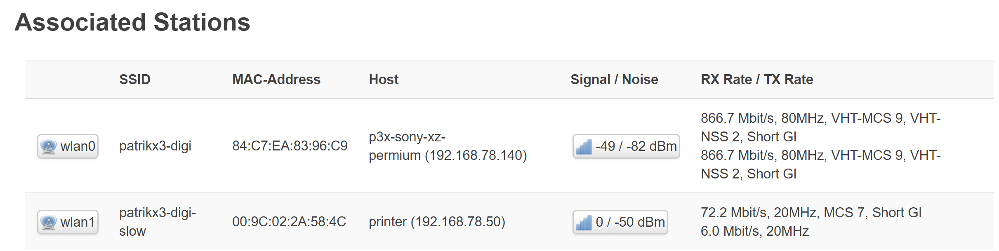

[//]: #@corifeus-header

## Latest Stable LEDE Version with many plus packages

---
                        
[//]: #@corifeus-header:end

# Linksys WRT 3200ACM 160Mhz

You have to find out the channel that in your country was setup with the router is working.
For me, I am Hungarian, but the router is FR based in FRANCE in EUROPE (or European is usually is FR), the ```100 channel``` is working.

But for now, it is using the ```radar detection``` and it is changing the channels and it works.

## Picture

 

## This is important

http://192.168.1.1/cgi-bin/luci/admin/network/wireless/radio0.network1

Below:
```Wireless scurity``` set ```Cipher``` to ```Force CCMP (AES)```.


[//]: #@corifeus-footer

---

[**P3X-LEDE-INSOMNIA**](https://pages.corifeus.com/lede-insomnia) Build v17.1.53-366 

[](https://www.facebook.com/corifeus.software) 
 

[//]: #@corifeus-footer:end